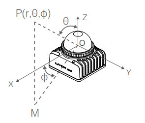

# Livox-3D-lidar
Detailed Basic setup of Livox lidar (model : MID360)

##  LIVOX MID360   

 

	
      
    

## Product Link : [LIVOX-MID-360](https://https://www.livoxtech.com/mid-360)

    

## Livox MID-360 LiDAR Sensor Features

- **Laser Wavelength**: 905 nm
- **Laser Safety**: Class 1
- **Field of View**: 
  - Horizontal: 360°
  - Vertical: -7° to 52°
- **Detection Range**: 
  - 40 meters at 10% reflectivity
  - 70 meters at 80% reflectivity
- **Point Rate**: 200,000 points per second
- **Frame Rate**: 10 Hz 
- **Operating Temperature**: -20°C to 55°C
- **Protection**: IP67 (water and dust resistant)

For more details, visit the [Livox MID-360 Specs](https://www.livoxtech.com/mid-360/specs).

## Electrical Connections

* Connect the **positive(Red) and negative (Black)** wire to Power supply.
* Operating VOltage : **9V to 27V**
* Connect the **Ethernet port** to the Laptop for  Data Communication.

## MID-360 Co-ordinates

* Cartesian Coordinates (x, y, z) 
    - Cartesian coordinates represent positions in a 3D space using three perpendicular axes
* Spherical coordinates (r, θ, φ)
   - spherical coordinates represent positions using a radial distance, an azimuthal angle, and a polar angle.

