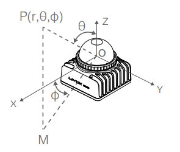

# Livox-3D-lidar
Detailed Basic setup of Livox lidar (model : MID360)

##  LIVOX MID360   

<br >
<div align="center">
	
    <br ></br>
    
</div>


## Product Link : [LIVOX-MID-360](https://https://www.livoxtech.com/mid-360)

<div align="center">
    
</div>


## Livox MID-360 LiDAR Sensor Features

- **Laser Wavelength**: 905 nm
- **Laser Safety**: Class 1
- **Field of View**: 
  - Horizontal: 360°
  - Vertical: -7° to 52°
- **Detection Range**: 
  - 40 meters at 10% reflectivity
  - 70 meters at 80% reflectivity
- **Point Rate**: 200,000 points per second
- **Frame Rate**: 10 Hz 
- **Operating Temperature**: -20°C to 55°C
- **Protection**: IP67 (water and dust resistant)

For more details, visit the [Livox MID-360 Specs](https://www.livoxtech.com/mid-360/specs).


## Electrical Connections


* Connect the **positive(Red) and negative (Black)** wire to Power supply.
* Operating VOltage : **9V to 27V**
* Connect the **Ethernet port** to the Laptop for  Data Communication.

## MID-360 Co-ordinates


* Cartesian Coordinates (x, y, z) 
    - Cartesian coordinates represent positions in a 3D space using three perpendicular axes
* Spherical coordinates (r, θ, φ)
   - spherical coordinates represent positions using a radial distance, an azimuthal angle, and a polar angle.

# Software setup

- I have used the **ROS2 HUMBLE** for visualizing the data from the Lidar.

> GITHUB PAGE FOR ROS2 DRIVER
> https://github.com/Livox-SDK/livox_ros_driver2

## Requirements

- ROS2 
> https://docs.ros.org/en/humble/Installation.html (distro: Humble)
- Colcon is a build tool used in ROS2.
```bash
sudo apt install python3-colcon-common-extensions 
```

- Lidar packages
  - Livox_ros2_driver
  - Livox SDK

## Livox_ros2_driver

```bash
mkdir -p livox_ws/src/

cd livox_ws/src/

git clone https://github.com/Livox-SDK/livox_ros_driver2.git 
```


> Note:
> Be sure to clone the source code in a '[work_space]/src/' folder (as shown above), otherwise compilation errors will occur due to the compilation tool restriction.

<div style="padding: 10px; border: 1px">
     <code> Without the LIVOX SDK, we cannot run theros2_driver</code>.
</div>

## Livox SDK installation: 

- Livox SDK2 is a software development kit designed for all Livox lidars.

### Install the CMake using apt
```bash
sudo apt install cmake
```
### Compile and install the Livox-SDK2

```bash
cd /livox_ws/src/

git clone https://github.com/Livox-SDK/Livox-SDK2.git

cd ./Livox-SDK

mkdir build

cd build

cmake .. && make -j

sudo make install
```

* After cloning livox_ros_driver2 and LIVOX-SDK2 we need to build  the following , 

```bash
cd livox_ws/src

./build.sh humble

source /opt/ros/humble/setup.sh
```
* Once both the packge is build and now we are ready to run the lidar.
- Last but not least we need to configure the IP address of the Lidar and the host_system (PC)

## IP Configuration

- You can launch the Livox viewer 2 for determining the Ip address of the Lidar.

* You can download the Livox viewer2

> [LIVOX VIEWER SOFTWARE](https://terra-1-g.djicdn.com/65c028cd298f4669a7f0e40e50ba1131/Mid360/LivoxViewer2%20for%20Ubuntu%20v2.3.0.zip)

* After determining the Lidar’s IP we need to configure our systems IP as same as the subnet of the Lidar’s IP.

Eg.

  * Lidar’s IP : 192.168.0.159

* Our system IP should be 192.168.0.<any_num>


### Lidar Launch config 

- LiDAR Configurations (such as ip, port, data type... etc.) can be set via a json-style config file.
- Config files for Mid360 are in the "config" folder.
- The parameter naming *'user_config_path'* in launch files indicates such json file path.
- We need to configure ,
  - Lidar's IP 
  - Host IP (System IP) in the config of the launch file for successful connection and communication with the Livox lidar.

### Lidar Launch files
```shell
source ../../install/setup.sh
ros2 launch livox_ros_driver2 [launch file]
```

in which,  

* **[launch file]**  is the ROS2 launch file you want to use; the 'launch_ROS2' folder contains several launch samples for your reference.


| launch file name          | Description                                                  |
| ------------------------- | ------------------------------------------------------------ |
| rviz_MID360.launch        | Connect to MID360 LiDAR device<br>Publish pointcloud2 format data <br>Autoload rviz |
| msg_MID360.launch         | Connect to MID360 LiDAR device<br>Publish livox customized pointcloud data          |

```bash
- ros2 launch livox_ros_driver2 rviz_MID360.launch

- ros2 launch livox_ros_driver2 msg_MID360.launch (This launch will be used in mapping purpose later on)
```


